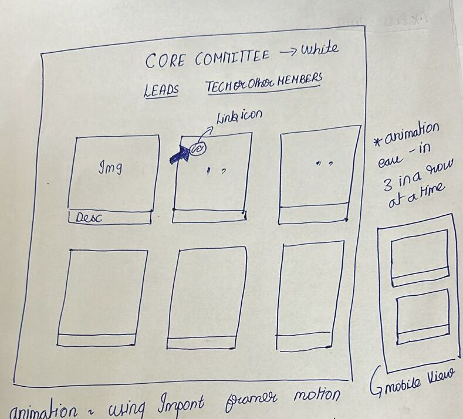

# CloudOps Core Committee Page
>Work in Progress

This folder contains the Core Committee Component code written in Next.js

## Page Layout

- Framer motion library is imported to design the animations
- There will be 2 sections
	1. Lead Members of each Department
	2. Other Members of the Club from every Department
- Each section showcases the respective members' details
- Upon hover event, the opacity of the member box decreases and icons of websites will be imported from heroicons and will be displayed for git and other platform profiles.